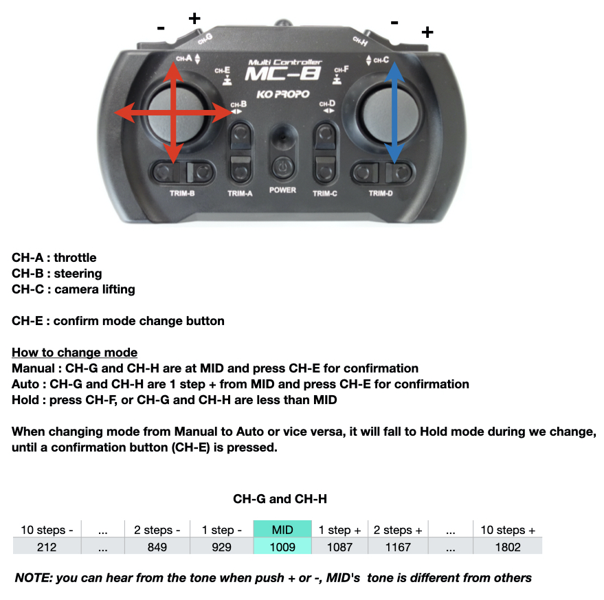
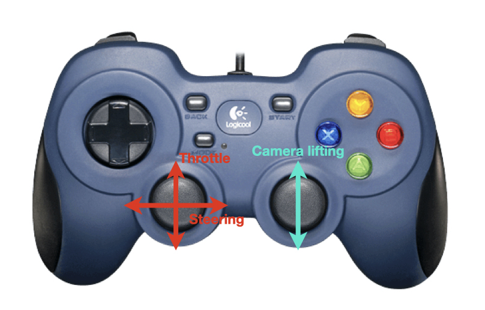
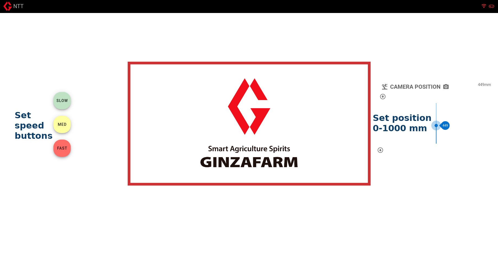
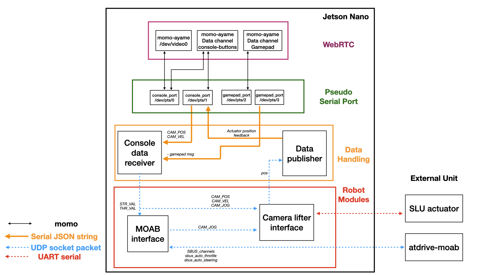

# NTT bot

The project purpose is to integrate mobile robot with 5G network for WebRTC robot control. The robot can be controlled locally by RC transmitter (KO-Propo) during WebRTC is booting, and once it's connected to the server and console browser is openning, the robot can be controlled by gamepad and console buttons.

## rover
We use atdrive-moab for a rover control with KO-Propo for an RC transmitter. This is a firmware of atdrive-moab for this robot https://github.com/rasheeddo/atdrive-moab/tree/XWheels-dev-SBUS_throttle_steering .

We can drive the robot manually without Jetson nano and can be set to Hold mode anytime when the robot is out of control. Please check on the image below for mode changing switches.

 

Once we change the mode on KO-Propo to Auto, all of throttle. steering, and camera lifting control will be taking care by Jetson Nano, and that's allow us to control the robot by using WebRTC. The gamepad's anaglog sticks are assigned the same manner as KO-Propo (left stick for cart-control, right stick for camera control).

 

The camera position can also be controlled by the buttons in the console. There are 3 buttons on left side of the console page to select the speed of the camera, and the right side contains a slider option on which the desired position of the camera can be chosen.

 

## Jetson Nano
The software architecture of this robot is shown here

 

At the present time, we have only two robot modules which is `moab_interface` and `camera_lifter_interface`, in the future we can add extra module for additional requirement.
